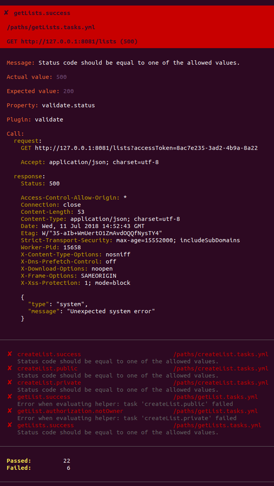

[](https://github.com/standard/standard)
[](https://www.npmjs.com/package/test-openapi)


Automatic API integration testing.

# Features

- **Declarative**. Tests are specified in simple YAML files.
- **Easy**. Each test is a single HTTP request/response. You only need to specify
  the request parameters and the response validation.
- Integrated to [**OpenAPI**](https://www.openapis.org/). Tests re-use your
  [OpenAPI](https://www.openapis.org/) specification by default, making them
  less verbose and ensuring they match your documentation.
- **Fast**. Tests have minimum overhead and run in parallel.
- Nice **developer experience**. Reporting is pretty, informative and usable.
- **Flexible**. Core functionalities can be extended with plugins.

# Usage

```shell
yarn integrationTest
```

# Tests

Tests are specified in YAML (or JSON) files at `./**/*.tasks.yml`

Those files are plain objects where each key represents a single test.

A single test performs the following:

- sends an HTTP request to the API. The request parameters are specified
  using the `call` property.
- validates the HTTP response according to the `validate` property.

# Example

```yml
exampleTest:
  call:
    method: GET
    server: http://localhost:8081
    path: /tags
    query.onlyPublic: false
  validate:
    status: 200
    body:
      type: array
      # Each tag object
      items:
        type: object
        required: [tag, isPublic]
        properties:
          tag:
            type: string
            maxLength: 32
          isPublic:
            type: boolean
```

This test calls:

```http
GET http://localhost:8081/icoTagNames?onlyPublic=false
```

It then validates that:

- the response status is `200`
- the response body is an array of `{ tag: string, isPublic: boolean }`

# Reporting

This screenshot shows a typical test run with few test failures.



The failed test is called `getLists.success` and performs the following HTTP request:

```http
GET http://127.0.0.1:8081/lists?accessToken=8ac7e235-3ad2-4b9a-8a22
```

It expects a status code of 200 but receives 500 instead.

Other tests are shown failing at the end. A final summary is also present.

# OpenAPI

If you have already described your API endpoints with
[OpenAPI](https://www.openapis.org/), the following will automatically be re-used
in the tests (so you don't need to repeat them): HTTP method, URL, path,
query variables, request body, response status, response headers
and response body.

You only need to specify request parameters and response validation when they
differ from the OpenAPI specification. For example: "if this query variable is
set to this specific value, validate that the status code is 403". They will
be deeply merged to the OpenAPI specification.

To re-use the OpenAPI specification, the `operationId` must be prefixed to the
test's key.

The above example could then be simplified to:

```yml
getTags.exampleTest:
  call:
    query.onlyPublic: false
  validate: {}
```

OpenAPI parameters that are `required` are always re-used. OpenAPI parameters that
are not `required` are only re-used if specified in the `call` property.

# Available properties

Each test can use the following properties:

```yml
operationId.testName:
  call:
    method: string
    server: string
    path: string
    url.NAME: any
    query.NAME: any
    headers.NAME: any
    body: any
  validate:
    status: number
    headers.NAME: any
    body: any
# More tests
...
```

- `operationId`: OpenAPI's `operationId`, i.e. a unique string identifying
  an endpoint. For example `getTags`.
- `testName`: an arbitrary name for the test.
- `call`: HTTP request parameters
  - `method`: HTTP method
  - `server`: server's origin (protocol + host)
  - `path`: URL's path
  - `url.NAME`: variable inside the URL using `{NAME}` notation.
    For example, if the path is `/companies/{companyId}` it can be `path.companyId`.
  - `query.NAME`: URL query variable
  - `headers.NAME`: HTTP request header
  - `body`: request body
- `validate`: HTTP response
  - `status` (default: `200`): HTTP status code
  - `headers.NAME`: response header
  - `body`: response body

# Response validation

`validate.status`, `validate.headers.NAME` and `validate.body` are checked against
the HTTP response. They can either be:

- any value checked for equality
- a [JSON schema version 4](https://github.com/OAI/OpenAPI-Specification/blob/master/versions/2.0.md#schemaObject)

For example to validate that the response body is an array:

```yml
operationId.testName:
  validate:
    body:
      type: array
```

# Random value

The `$$random` template function can be used to generate random values based on a
[JSON schema](https://github.com/OAI/OpenAPI-Specification/blob/master/versions/2.0.md#schemaObject).

For example to generate a random password of minimum 12 characters:

```yml
operationId.testName:
  call:
    query.password:
      $$random:
        type: string
        minLength: 12
        pattern: '[a-zA-Z0-9]'
```

# Re-using another request's response

A request can save its response using `alias`. Other requests will be able to
re-use it by using template variables.
This creates sequences of requests.

```yml
createAccessToken:
  alias:
    accessToken: call.response.body.accessToken

operationId.testName:
  call:
    query.accessToken: $$accessToken
```

# Empty parameter

Using the value `null` or the JSON schema `type: 'null'` means "not set".

For example "do not generate this request parameter", "this response header should not
be present" or "the response body should be empty".
